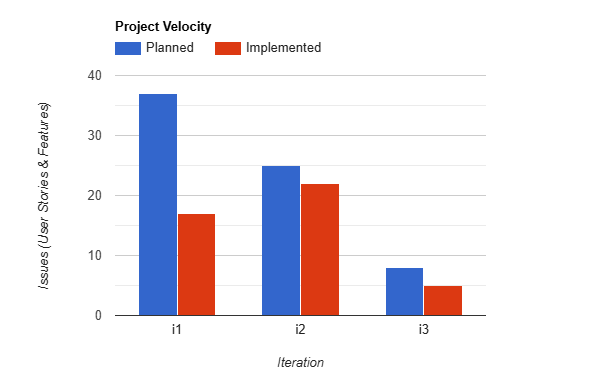

COMP 3350 GROUP 4 i3 RETRO

During the development of FitTrack, there have been many struggles involved. Our single greatest failure was the tech debt that we accrued, which came to a head during i2 when we couldn't get our HSQLDB to work due to being dragged down by other parts of the code. Thankfully, we learned about dealing with tech debt in class, and the primary focus for i3 has been on refactoring everything to both closer follow the concepts we learned in class, and to just be easier to work with.

The main reasons we made this tech debt were three-fold. Firstly, we simply did not realize that the way we were building our program was not conducive to features we wanted to add further down the line. An example is how our methods of database handling worked for what we had at the time for i2, but once we attempted to scale up and add more features the old way of data handling became a bottleneck and had to be refactored. The second reason is that as the deadline approached, keeping proper coding practises became less important than making sure the code functioned. The final reason is due to our unfamiliarity with android development, and specifically Android Studio. It has been a massive learning opportunity to work in an android development environment like we have, but we struggled with being able to correctly use many of the given tools both for development but also for testing. As our familiarity with the tools grew, our problems lessened, allowing us to avoid tech debt easier than before.

The best way to improve our current position would be to refactor a majority of the code to be more in line with what we learned in class. Specifically we need to severely reduce our coupling and code smells. Our coupling being too high is what hurt us the most in i2, especially with how the little refactoring we did do during i2 caused all of our tests to not be able to run at all. To fix this, we are going to focus on minimizing the amount and types of data being passed between layers, as well as a general cleanup of our entire codebase. The removal of many hardcoded portions of code, such as strings or constants, is also a secondary objective.

As our i2 was just short of disastrous, as a group we have no way to go but up. There are many ways for us to measure our improvement. The most obvious way to measure the difference between i2 and i3 would be the amount of tests that run, as we had no tests work during i2 so any tests that work during i3 can be considered both measurable and objective. Another way would be to measure how much less data we are passing between layers after we are done refactoring, but that can be much more difficult to count.

